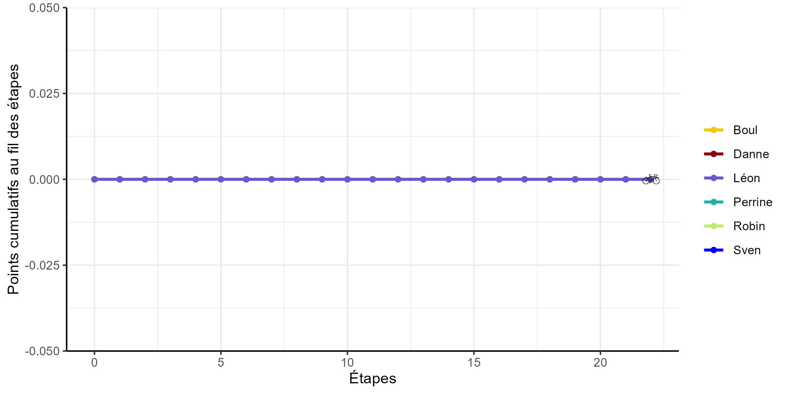

```{r setup, echo = FALSE , include=FALSE}
knitr::opts_chunk$set(warning = FALSE, message = FALSE)

library(flextable)
library(ggplot2)
library(tidyverse)
library(ggimage)

lineW <- 1.0

# save the picture for the evolution of the standings
evolStandings <- read.csv("data/evolStandings.csv")

maxEtape <- max(which(!is.na(evolStandings$Boul)))

evolPlot <- ggplot()+
  # Sven
  geom_point(aes(x= evolStandings$etappe, y = evolStandings$Sven,colour = "Sven"))+
  geom_line(aes(x= evolStandings$etappe, y = evolStandings$Sven,colour = "Sven"),lwd = lineW)+
  geom_image(aes(x = evolStandings$etappe[maxEtape] , y = evolStandings$Sven[maxEtape] , image = "img/bike.png"))+
  # Boul
  geom_point(aes(x= evolStandings$etappe, y = evolStandings$Boul,colour = "Boul"))+
  geom_line(aes(x= evolStandings$etappe, y = evolStandings$Boul,colour = "Boul"),lwd = lineW)+
  geom_image(aes(x = evolStandings$etappe[maxEtape] , y = evolStandings$Boul[maxEtape] , image = "img/bike.png"))+

  # Perrine
  geom_point(aes(x= evolStandings$etappe, y = evolStandings$Perrine,colour = "Perrine"))+
  geom_line(aes(x= evolStandings$etappe, y = evolStandings$Perrine,colour = "Perrine"),lwd = lineW)+
  geom_image(aes(x = evolStandings$etappe[maxEtape] , y = evolStandings$Perrine[maxEtape] , image = "img/bike.png"))+

  # Robin
  geom_point(aes(x= evolStandings$etappe, y = evolStandings$Robin,colour = "Robin"))+
  geom_line(aes(x= evolStandings$etappe, y = evolStandings$Robin,colour = "Robin"),lwd = lineW)+
  geom_image(aes(x = evolStandings$etappe[maxEtape] , y = evolStandings$Robin[maxEtape] , image = "img/bike.png"))+

  # Danne
  geom_point(aes(x= evolStandings$etappe, y = evolStandings$Danne,colour = "Danne"))+
  geom_line(aes(x= evolStandings$etappe, y = evolStandings$Danne,colour = "Danne"),lwd = lineW )+
  geom_image(aes(x = evolStandings$etappe[maxEtape] , y = evolStandings$Danne[maxEtape] , image = "img/bike.png"))+ 
  
  # Léon
  geom_point(aes(x= evolStandings$etappe, y = evolStandings$Léon,colour = "Léon"))+
  geom_line(aes(x= evolStandings$etappe, y = evolStandings$Léon,colour = "Léon"),lwd = lineW )+
  geom_image(aes(x = evolStandings$etappe[maxEtape] , y = evolStandings$'Léon'[maxEtape] , image = "img/bike.png"))+ 

  # settings
  scale_color_manual(name = "", values = c("gold2","darkred","slateblue3","lightseagreen","darkolivegreen2","blue"))+
  ylab("Points cumulatifs au fil des étapes")+
  xlab("Étapes")+
  theme(legend.position="bottom")+
  ylim(c(0,max(evolStandings[,2:6],na.rm = T)*1.2))+
  theme_bw()+
  theme(axis.line = element_line(colour = "black"),
    # panel.grid.major = element_blank(),
    # panel.grid.minor = element_blank(),
    panel.border = element_blank(),
    panel.background = element_blank())

ggsave("img/evolPlot.png",evolPlot,width = 20, height = 10,unit="cm")

```

## Résultats généraux

```{r }
#| label: tbl-standings
#| tbl-cap: Résultats généraux après la dernière étape parcourue

standings <- read.csv("data/standings.csv",encoding = "UTF-8")

standings$Points <- round(standings$Points,digits = 1)

standings <- standings[order(standings$Points,decreasing = TRUE),]

standingsTable <- flextable(standings)%>%
                  width(width=c(4,4), unit = "cm")

standingsTable

```

## Évolution des résultats généraux

{#fig-evolPlot}
